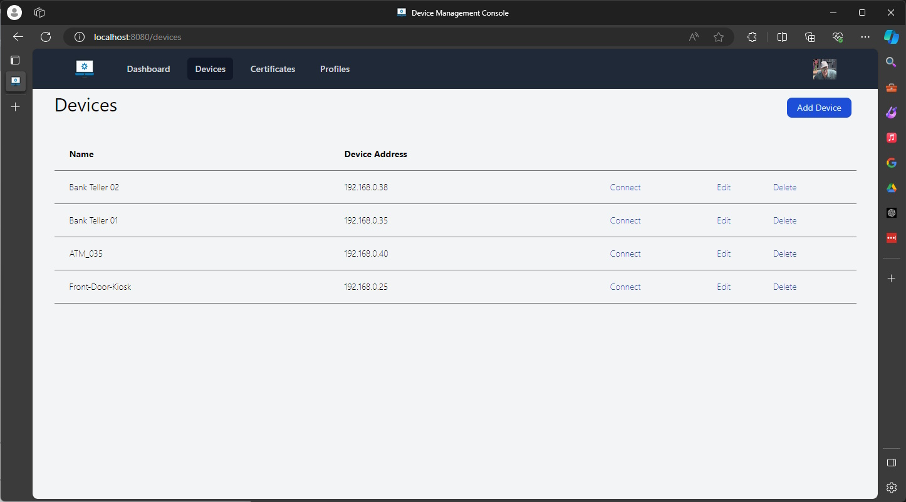

# Console

[](https://discord.gg/yrcMp2kDWh) 

A web-based UI for connecting to and managing Intel(r) Active Management Technology (AMT) devices over the local network.

Running the Console application will automatically launch the UI in the default browser.  How to use:
1. Click the **Add Device** button
2. Provide connection information for the Intel(r) AMT device (friendly name, IP Address, AMT Credential). **Note:** For AMT 16.1 and newer systems, "Use TLS" is required and "Self-Signed OK" is required if TLS has not been configured.
3. Click **Connect** and Console will connect to the device and show the AMT device page with information gathered from the AMT device.



## Developer Setup

### Prequisites
- [Golang](https://go.dev/dl/)
- [Air](https://github.com/cosmtrek/air)
``` bash
# With go 1.22 or higher:
go install github.com/cosmtrek/air@latest
```
- [Tailwind](https://tailwindcss.com/)
``` bash
# Example for win x64
curl -sLO https://github.com/tailwindlabs/tailwindcss/releases/latest/download/tailwindcss-windows-x64
move tailwindcss-windows-x64 tailwindcss

# Example for linux x64
curl -sLO https://github.com/tailwindlabs/tailwindcss/releases/latest/download/tailwindcss-linux-x64
chmod +x tailwindcss-linux-x64
mv tailwindcss-linux-x64 tailwindcss

# Example for macOS arm64
curl -sLO https://github.com/tailwindlabs/tailwindcss/releases/latest/download/tailwindcss-macos-arm64
chmod +x tailwindcss-macos-arm64
mv tailwindcss-macos-arm64 tailwindcss
```

### Develop

```
 Choose a make command to run

  init          initialize project (make init module=github.com/user/project)
  vet           vet code
  test          run unit tests
  build         build a binary
  dockerbuild   build project into a docker container image
  start         build and run local project
  css           build tailwindcss
  css-watch     watch build tailwindcss
```

### Build
```bash
go build -ldflags -H=windowsgui -o console.exe -v ./cmd/main.go
```


## Additional Resources

- For detailed documentation and Getting Started, [visit the docs site](https://open-amt-cloud-toolkit.github.io/docs).

- Looking to contribute? [Find more information here about contribution guidelines and practices](.\CONTRIBUTING.md).

- Find a bug? Or have ideas for new features? [Open a new Issue](https://github.com/open-amt-cloud-toolkit/mps/issues).

- Need additional support or want to get the latest news and events about Open AMT? Connect with the team directly through Discord.

    [](https://discord.gg/yrcMp2kDWh)
